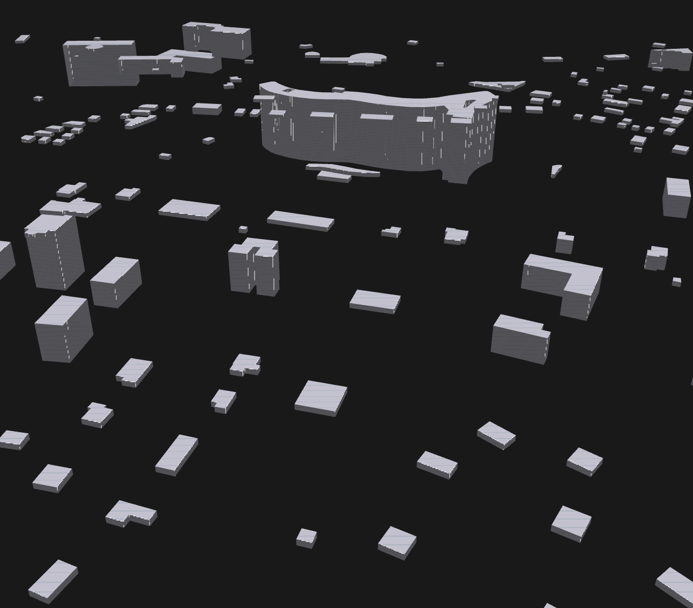

# cbv
A WebGL city buildings visualizer based on OSM data

> Warning: This is an experimental and recreative project and may contain bugs or incomplete features.

## References

- https://developer.mozilla.org/en-US/docs/Web/API/WebGL_API/Tutorial
- https://webglfundamentals.org/webgl/lessons/webgl-2d-matrices.html
- https://overpass-turbo.eu/

